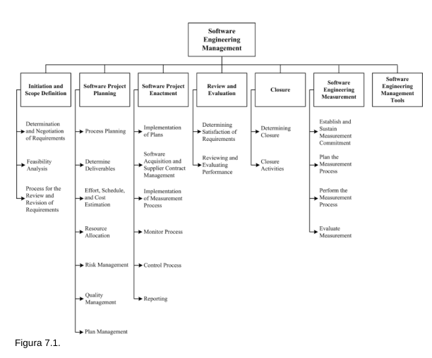

# PARCIAL 1

---

# Introduccion

Un sistema es una combinacion de elementos que interactuan organizados para lograr uno o mas
propositos.

Configuracion de un sistema son las cacateristicas funcionales y de hard o soft tal como se
establece en una documentacion tecnica o en el mismo producto.

La gestion de configuracion es la disciplica de identificar la configuracion de un sistema en
distintos momentos para documentar y manterner una ttrzabilidad durante su periodo de vida.

El SCM (gestion de conf del soft) es un proceso natural del ciclo de vida del soft.
Es parte del proceso de garantia de calidad del software (SQA).

Las actividades SCM:
- son la gestion y planificacion del SCM
- la identificacion de la configuracion del softw
- el control de la conf de soft
- contabilidad del estado de la conf
- la auditoria del soft
- gestion y entrega de la version de soft

## Desgloce de temas para SCM

### _Gestion del proceso SCM_:

controla la evolucion e integridad del producto identificando registrando y verificando los
cambios, de lo que se debe tener en cuenta es:
  + contexto organizacional del SCM:
      para u nproyecto es necesario comprender la ogranizacion de la empresa y sus relaciones.
      Despues te cuenta su vida de que tiene que organizar el software con el hardware para que
      sea coherente con la meta.

  + REstricciones y orientacion:
      el proyecto tiene restricciones y limitaciones que afectan a crear el plan SCM, dados por
      el contrato, las regulaciones y restricciones a nivel corporativo como presupuesto.

      El desgloce de la gestion scm

#### Planificacion del SCM:

debe ser coherente con las restricciones, el contexto, la direccion y la naturaleza del
proyecto.

Las actvidades principales son:
  - identificar la confi del soft
  - control de conf del soft
  - contabilidad del estado de la conf
  - auditoria de la conf del soft
  - gestion y entrega de la version del soft

      ASpectos a tener en cuenta para esto:
-  ORganizacion y responsabilidades del SCM:
    identificar claramente los roles dentro del proyecto
- REcursos y horarios:
    identificar el personal, las herramientas y elaborar un horario (schedule) de las actividades
    e hitos.
- Seleccion e implementacion de herramientas:
    se denominan bancos de trabajo (puede ser abierto o integrado)
- Control de proveedores y subcontratistas:
    tomar en cuenta para la planificacion el software y mano de obra de terceros.
- Control de interfaz:
    especificar como se conectan los componenetes.
    Se lleva a cabo dentro del proceso y a nivel del sistema

#### Plan SCM

Los resutlados de la planificacion se poenen e un plan de gestion, un doc que sirve como
referencia para el proceso SCM.
Se actualiza segun sea necesario.

Los requisitos que debe contener son:
- introduccion (proposito, alcance y glosario) 
- Gestion SCMintroduccion (responsabilidades, organizacion, autoridades y procedimientos)
- Actividades SCM (lo que ya esta listado mas arriba)
- Cronogramas SCM
- Recursos SCM (herramientas, recursos fisicos y humanos)
- Mantenimiento

#### Vigilancia de la gestion de configuracion

Una vez se implementa el proceso del SCM, es necesario cierto nivel de vigilancia para ver que
se cumplan los requerimientos del SQA.
El responsable de SCM se encarga de monitorear a las personas encargadas de cada funcion

Para ello se requiere de herramientas y medidas de medicion de la calidad y estado del proceso
SCM

Asi tambien se pueden realizar auditorias durante el proceso SCM.

### Identificacion de la conf del soft

Identifcica los elementos a controlar y los esquemas de identificacion de elementos y
versiones, asi como las tecnicas y herramientas a ser utilizads.

Su desgloce:
- Identificar los elementos a controlar:
    identificar y categorizar los elementos del software a monitoriear:
    + Configuracion del software (engloba a las caracts funcionales y de hardw o softw)
    + Un elemento de la configuracion del software (conjunto de soft y hardw que se considera
        una sola unidad)
    + Relacion de los elemntos de la configuracion
    + Version del software (una instancia identificadda de un elemento de config)
    + Linea Base (version aprovada formalmente en un doc de conf de un elemento de la conf del
        software)
    + Adquirir elementos de la conf del softwar:
        se acoplan nuevos elementos en un instante de tiempo en base a una linea base
    + Libreria de software:
        coleccion controlada de soft y documentacion asociada

### Control de conf del softw

Gestionar los cambios durante la vida del softw.

Pasos:
- Solicitar, evaluar y aprobar cambios en el softw
    + Tablero de configraciuon de softw:
        la autoridad que acepta o rechaza los camibos propuesto se llama Junta de control de
        configuracion (CCB, SCCB si es solo responsable de softw) o en el lidel del proyectoa.
    + Proceso de solicitud de cambio del sftw
- Implementacion de los cambios:
    los camibos se implementan segun el cronograma y pueden ser sometidos a auditoria, etc. Se
    requiere un modo de rastrear cada cambio y su estado (tickets)
    ```txt
    [cambio] -- solicitud --> [revision]
    [revision] -- aprobacion --> [modificacion]
    [modificacion] -- acoplamiento --> [linea base]
    [implementacion] -- entrega --> [version de sftw]
    ```
- Desviacion y exenciones:
    Una desviación es una autorización escrita, otorgada antes de la fabricación de un
    artículo, para apartarse de un requisito de diseño o desempeño particular para un número
    específico de unidades o un período de tiempo específico.
    Una exención es una autorización por escrito para aceptar un elemento de configuración u
    otro elemento designado que, durante la producción o después de haber sido enviado para
    inspección, se desvía de los requisitos especificados pero que, sin embargo, se considera
    adecuado para su uso tal como está o después de ser reelaborado por un proveedor aprobado

### Contabilidad de la confi de softw

- Captura de informacion del estado de software (sacar estadisticas e informacion de las
    versiones de la confi)
- Generar informes (para respondeer a preguntas del management)

### Auditoria de la conf

es un examen independiente de un producto de trabajo o un conjunto de productos de trabajo para
evaluar el cumplimiento de especificaciones, estándares, acuerdos contractuales u otros
criterios.
se llevan a cabo de acuerdo con un proceso bien definido por parte del auditor

tipos:
- Auditoria de la configuracion funcional del sftw:
    garantizar que el softw cumpla con las especificaciones de la config
- Auditoria de la confi fisica del softw:
    de que el disenho y la documentacion sea consistente
- Auditoria de linea base:
    auditoria sobre elementos de referencia previamente muestreados (la linea base).
    En cristiano, no se hace sobre el estado actual de la configuracion, sino que sobre la linea
    base


### Gestion y entrega del softw

distribución de un elemento de configuración de software fuera la actividad de desarrollo.
Incluye lanzamientos internos y entregas al cliente.

Partes:
- Construccion del sftw:
    distribución de un elemento de configuración de software fuera la actividad de desarrollo
    (aka, como deployar en produccion gente y la doc asociada a eso).
    Es necesario que SCM tenga la capacidad de reproducir versiones anteriores con fines de
    recuperación, prueba, mantenimiento
  - Gestion de versiones:
      abarca la identificación, empaquetado y entrega de los elementos de un producto.
      Las notas de la versión suelen describir nuevas capacidades, problemas conocidos y
      requisitos de plataforma necesarios para el funcionamiento adecuado del producto
      (changelogs)


### HErramientas de gestion de la conf

Cuando se habla de herramientas de gestión de configuración de software, resulta útil
clasificarlas: 
- soporte individual, 
- soporte relacionado con proyectos
- soporte para procesos de toda la empresa


- Herramientas de control de versiones:
    rastrea, documenta y almacena elementos de configuración individuales, como código fuente y
    documentación externa.
- Construir herramientas de manejo:
    dichas herramientas compilan y vinculan una versión ejecutable del software.
    Las herramientas de creación más avanzadas producen diversos tipos de informes, entre otras
    tareas.
- Herramientas de control de cambios:
    apoyan principalmente el control de solicitudes de cambio y notificación de eventos (por
    ejemplo, cambios de estado de solicitudes de cambio, hitos alcanzados) (jira, sistema de
    tickets.

---

# Parcial 2

---

ACRONIMOS LOCOS

- KA:
    knowledge area

# Gestion de la Ing. de Softw

a gestión de la ingeniería de software se puede definir como la aplicación de actividades de
gestión:
planificación, coordinación, medición, seguimiento, control y presentación de
informes.1—para garantizar que los productos de software y los servicios de ingeniería de
software se entreguen de manera eficiente, efectiva y en beneficio de las partes interesa

La gestion se da en tres niveles:
organizacional e infraestructura, gestion de proyectos y gestion de programas de medicion.

## Problemas de la gestion del la Is:

Los clientes a menudo no comprenden las complejidades inherentes a la ingeniería de software,
especialmente en cuanto al impacto de los requisitos cambiantes.

Esta falta de comprensión lleva a:
- Requisitos de software nuevos o modificados debido a condiciones cambiantes.
- Proceso de desarrollo iterativo en lugar de una secuencia de tareas cerradas.
- Necesidad de equilibrar creatividad y disciplina en la ingeniería de software.
- Alto grado de novedad y complejidad en los proyectos.
- Cambios rápidos en la tecnología subyacente.

    


El desglose de actividades en proyectos de desarrollo de software, que se presenta en la Figura
7.1, organiza las actividades clave de gestión para cualquier modelo de ciclo de vida.
Este enfoque no recomienda un modelo específico, sino que detalla las actividades principales
que suceden en cada proyecto, sin especificar el orden o la frecuencia.
Estas actividades son:

### 1. **Iniciación y Definición de Alcance**:

Decide la viabilidad del proyecto y determina requisitos iniciales.
Implica:
   - **1.1 Determinación y Negociación de Requisitos**:
       Define los requisitos mediante obtención, análisis, especificación y validación.
       Se considera la perspectiva de las partes interesadas para delimitar el alcance.
   - **1.2 Análisis de Viabilidad**:
       Evalúa si el proyecto es viable dadas las limitaciones tecnológicas, financieras y
       sociales, proponiendo una descripción inicial del alcance, entregables y recursos
       necesarios.
   - **1.3 Proceso para la Revisión y Revisión de Requisitos**:
       Establece un proceso para gestionar cambios en los requisitos, adaptando el alcance según
       sea necesario.


###  Planificación de Proyectos de Software

- Seleccionar un modelo de ciclo de vida adecuado para el desarrollo, adaptándolo según el
    alcance, requisitos y evaluación de riesgos del proyecto.
- La planificación inicial debe incluir una evaluación de riesgos con un perfil aceptado por
    todas las partes interesadas.
- Determinar los procesos de calidad de software para asegurar, verificar, validar y auditar la
    calidad.

    2.1.
    Planificación de Procesos
    - Los modelos del ciclo de vida (SDLC) abarcan desde lo predictivo hasta lo adaptativo.
    - SDLC predictivos:
        detallan requisitos y planificaciones con pocas iteraciones.
    - SDLC adaptativos:
        adaptan requisitos emergentes con ciclos iterativos.
    - Incluir herramientas de software para programación, requisitos, diseño, construcción,
        mantenimiento y gestión de configuración.

        2.2.
        Determinar los Entregables
    - Identificar y caracterizar productos de trabajo para cada actividad del proyecto (ej.
        documentos de diseño, informes).
    - Evaluar oportunidades de reutilización de componentes de proyectos previos o de
        productos de mercado.
    - Planificar la adquisición de software y seleccionar proveedores externos según
        secciones relevantes.

        2.3.
        **Estimación de esfuerzo, cronograma y costos** 1.
        **Estimación del Esfuerzo:** - Se utiliza un modelo de estimación basado en datos
        históricos, con métodos adicionales como juicio de expertos y analogía.
        2.
        **Dependencias y Cronograma:** - Se identifican tareas secuenciales y paralelas con
        herramientas como diagramas de Gantt.
    - En proyectos SDLC predictivos, se establece un cronograma detallado.
        En SDLC adaptativos, la estimación se hace a partir de los requisitos iniciales.
        3.
        **Costos:** - Los requisitos de recursos se traducen en estimaciones de costos,
        considerando personas y herramientas.
        4.
        **Iteración y Revisión:** - La estimación inicial del esfuerzo, cronograma y costo es
        revisada y consensuada entre las partes interesadas.

        2.4.
        **Asignación de recursos** 1.
        **Asignación de Equipos y Responsabilidades:** - Se asignan equipos, instalaciones y
        personas a tareas específicas.
    - Una matriz de responsabilidad (RACI) define quién es responsable, rendirá cuentas,
        será consultado e informado en cada tarea.
        2.
        **Optimización de Recursos:** - La asignación depende de la disponibilidad y uso óptimo
        de recursos, incluyendo factores de productividad y dinámica de equipo.

        2.5.
        **Gestión de riesgos** 
        1. **Definición y Naturaleza del Riesgo:** - Se distingue entre incertidumbre (falta de
        información) y riesgo (probabilidad de impacto negativo).
        2. **Identificación y Evaluación:** - Se identifican factores de riesgo, y se analiza su
        probabilidad e impacto potencial.
        Se priorizan los riesgos y se desarrollan estrategias de mitigación para minimizar su
        impacto.
        3. **Evaluación Continua:** La gestión de riesgos debe realizarse periódicamente,
        adaptándose a riesgos propios del software (ej.
        sobrecarga de funcionalidades, intangibilidad).
        Atención especial en los requisitos de calidad, como seguridad.

        2.6.
        **Gestión de la calidad** 1.
        **Definición de Requisitos de Calidad:** - Se identifican los requisitos de calidad,
        definidos en términos cuantitativos y cualitativos, y se establecen umbrales aceptables.

        2.7.
        **Gestión de planes**
        1. **Planificación de la Gestión del Proyecto:**
    - En proyectos de software, donde el cambio es una expectativa, se debe planificar la
        gestión del plan del proyecto.
    - Los planes y procesos seleccionados deben monitorearse, revisarse, informarse y, cuando
        corresponda, revisarse sistemáticamente.
    - La gestión también incluye los planes asociados con los procesos de soporte (por
        ejemplo, documentación, gestión de la configuración del software y resolución
        de problemas).
        2. **Ajuste a SDLC y Realidades del Proyecto:**
    - La presentación de informes, el seguimiento y el control deben ajustarse al SDLC
        seleccionado y a las realidades del proyecto.
    - Los planes deben considerar los artefactos que se utilizarán para gestionar el proyecto.

        3. **Ejecución del Proyecto de Software**
        1. **Implementación de los Planes:**
    - Durante la ejecución del proyecto, se implementan los planes y se promulgan los procesos
        establecidos en ellos.
    - Se debe garantizar el cumplimiento del SDLC seleccionado para asegurar la satisfacción
        de los requisitos de las partes interesadas y el logro de los objetivos del
        proyecto.
        2. **Gestión de Seguimiento, Control y Presentación de Informes:**
    - Es fundamental mantener una gestión continua de seguimiento, control y presentación de
        informes durante la ejecución del proyecto.

### Ejecucion del proyecto

Durante esta fase se impoementan los planes y se promulgan procesos.
EN todo momento se debe seguir un cumplimiento de procesos SDLC.

3.1.
**Implementación de Planes**
1. **Desarrollo según el Plan:**
- Las actividades deben llevarse a cabo de acuerdo con el plan del proyecto y los planes de
    apoyo.
- Se utilizan los recursos (personal, tecnología, financiación) y los productos del trabajo
    (diseño de software, código de software, casos de prueba).

    3.2.
    **Adquisición de Software y Gestión de Contratos de Proveedores**
    1. **Gestión de Contratos:**
- La gestión de contratos de proveedores y la adquisición de software abordan cuestiones
    relacionadas con la contratación de productos entregables con clientes y proveedores.
- Se eligen tipos de contrato como precio fijo, tiempo y materiales, o costo más tarifa fija o
    de incentivo.
- Los acuerdos especifican el alcance del trabajo, entregables y cláusulas como sanciones por
    entrega tardía, así como acuerdos sobre propiedad intelectual.
    2. **Gestión de Ejecución Según el Acuerdo:**
- Una vez establecido el acuerdo, se debe gestionar la ejecución del proyecto de acuerdo con
    los términos pactados.

    3.3.
    **Implementación del Proceso de Medición**
    1. **Recopilación de Datos Relevantes:**
- El proceso de medición debe implementarse durante el proyecto para asegurar que se recopilen
    datos relevantes y útiles.
- Consulte las secciones 6.2 y 6.3 para detalles sobre cómo planificar y realizar el proceso
    de medición.


3.4.
Monitorear el proceso
1. **Evaluación continua del plan y tareas**: 
  - Monitorear el cumplimiento del plan de proyecto y los planes relacionados de forma continua
      y en intervalos predeterminados.
  - Evaluar los resultados y los criterios de finalización de cada tarea.
  - Inspeccionar los entregables para verificar sus características requeridas, como la
      funcionalidad de trabajo.

      2. **Análisis de recursos y progreso**:
  - Analizar los gastos de esfuerzo, el cumplimiento del cronograma y los costos hasta la
      fecha.
  - Examinar el uso de los recursos disponibles.
  - Revisar el perfil de riesgo del proyecto.

      3. **Evaluación de calidad**: 
  - Evaluar el cumplimiento de los requisitos de calidad del software.
  - Analizar los datos de medición utilizando análisis estadístico.
  - Realizar análisis de varianza basado en la desviación de los resultados y los valores
      esperados.

      4. **Identificación de problemas**:
  - Detectar problemas y excepciones mediante el análisis de valores atípicos y la calidad de
      los datos.
  - Recalcular las exposiciones al riesgo.

      5. **Informe de resultados**:
  - Informar los resultados cuando se superen los umbrales o cuando sea necesario.

      3.5.
      Proceso de control
      1. **Base para decisiones**:
  - Utilizar los resultados del monitoreo para tomar decisiones sobre el proyecto.
  - Evaluar los factores de riesgo y su impacto para realizar cambios si es necesario.

      2. **Acciones correctivas**:
  - Implementar acciones correctivas como volver a probar componentes de software.
  - Incluir acciones adicionales, como la creación de prototipos para validar los requisitos.

      3. **Revisión de documentos**:
  - Revisar el plan del proyecto y otros documentos para adaptarse a eventos imprevistos.
  - Si es necesario, abandonar el proyecto según el análisis.

      4. **Cumplimiento de procedimientos**:
  - Asegurar el cumplimiento de los procedimientos de control de configuración de software y
      gestión de la configuración.
  - Documentar y comunicar las decisiones tomadas.

      5. **Revisión y registro**:
  - Revisar los planes según sea necesario.
  - Registrar los datos relevantes del proceso de medición.

      3.6.
      Informes
      1. **Progreso del proyecto**:
  - Informar sobre el progreso en momentos específicos a la organización y a las partes
      interesadas externas (clientes, usuarios).

      2. **Enfoque de los informes**:
  - Centrarse en las necesidades de información del público objetivo en lugar de en el estado
      detallado del equipo.

### 4. Revisión y evaluación
1. **Evaluación de progreso**:
  - Evaluar el progreso general hacia los objetivos establecidos y la satisfacción de los
      requisitos de las partes interesadas.

      2. **Evaluación de efectividad**:
  - Evaluar la efectividad del proceso de software, el personal y las herramientas utilizadas,
      según lo determinen las circunstancias.


### 4.1. Determinación de la satisfacción de los requisitos
- Evaluar el progreso hacia la satisfacción de los requisitos es esencial para el gerente de
    ingeniería de software.
- Este progreso se mide según el logro de los hitos clave, como la finalización de la
    arquitectura de diseño del software o la culminación de una revisión técnica.
- Las variaciones de los requisitos deben ser identificadas y se deben tomar acciones
    correctivas apropiadas.
- El proceso de control y gestión de la configuración del software debe seguirse
    adecuadamente, con decisiones documentadas y comunicadas a todas las partes interesadas, y
    con planes revisados según sea necesario.

### 4.2. Revisión y evaluación del desempeño
- Las revisiones periódicas del desempeño del personal del proyecto proporcionan información
    sobre la probabilidad de cumplir los planes y procesos establecidos.
- Se deben evaluar los métodos, herramientas y técnicas empleados en el proyecto para
    determinar su efectividad y adecuación.
- El proceso utilizado por el proyecto debe ser evaluado sistemáticamente para determinar su
    relevancia, utilidad y eficacia en el contexto del proyecto.
- Si es necesario, se deben realizar cambios para mejorar el desempeño.

### 5. Cierre
- El cierre de un proyecto o fase importante se produce cuando todos los planes y procesos se
    han completado y implementado.
- Se deben evaluar los criterios de éxito para determinar si el proyecto, fase o iteración se
    ha completado con éxito.
- Tras el cierre, se pueden realizar actividades de archivo, retrospectiva y mejora de
    procesos.

#### 5.1. Determinar el cierre
- El cierre se confirma cuando se han completado todas las tareas especificadas y se ha
    comprobado el cumplimiento de los criterios de finalización.
- Se debe evaluar si los requisitos del software se han cumplido y el grado de consecución de
    los objetivos.
- Los procesos de cierre deben involucrar a las partes interesadas relevantes y documentar la
    aceptación de los resultados, registrando cualquier problema conocido.

#### 5.2. Actividades de cierre
- Una vez confirmado el cierre, se debe archivar la documentación del proyecto siguiendo los
    métodos, ubicación y duración acordados por las partes interesadas.
- El análisis retrospectivo del proyecto, fase o iteración debe realizarse para revisar los
    problemas, riesgos y oportunidades encontrados.
- Las lecciones aprendidas deben ser extraídas e incorporadas a los esfuerzos de mejora y
    aprendizaje organizacional.

### 6. Medición de ingeniería de software
- La medición en ingeniería de software es fundamental para la gestión y mejora
    organizacional.
- Su aplicación abarca organizaciones, proyectos, procesos y productos de trabajo, siendo una
    de las piedras angulares de la madurez organizacional.


#### 6.1. Establecer y mantener el compromiso de medición

1. **Requisitos para la medición**:
  - Cada esfuerzo de medición debe estar alineado con los objetivos organizacionales.
  - Los requisitos de medición deben ser definidos por la organización y el proyecto
      (ejemplo:
      "ser el primero en llegar al mercado con nuevos productos").

      2. **Alcance de la medición**:
  - Definir la unidad organizacional a la que se aplicará cada requisito de medición.
  - Considerar el alcance temporal, ya que algunas mediciones pueden requerir series
      temporales, por ejemplo, para calibrar modelos de estimación.

      3. **Compromiso del equipo con la medición**:
  - El compromiso debe ser establecido, comunicado y respaldado formalmente con recursos.

      4. **Recursos para la medición**:
  - El compromiso de la organización con la medición es esencial para el éxito, incluyendo
      la asignación de recursos adecuados (fondos, capacitación, herramientas, apoyo).
  - Asignar responsabilidades para tareas del proceso de medición (por ejemplo, analistas y
      bibliotecarios).

#### 6.2. Planificar el proceso de medición

1. **Caracterizar la unidad organizativa**:
  - El contexto organizacional debe ser explícito, incluyendo limitaciones impuestas por la
      organización sobre el proceso de medición.
  - La caracterización puede incluir procesos organizacionales, tecnología, interfaces y
      estructura organizacional.

      2. **Identificar las necesidades de información**:
  - Basadas en los objetivos, limitaciones, riesgos y problemas de la unidad organizacional.
  - Las partes interesadas deben priorizar, seleccionar, documentar y comunicar un subconjunto
      de objetivos a abordar.

      3. **Seleccionar medidas**:
  - Elegir medidas que estén vinculadas a las necesidades de información.
  - Considerar el costo de recopilación, el grado de interrupción del proceso, la facilidad
      para obtener datos precisos y consistentes, y la facilidad para analizar y presentar
      informes.

      4. **Definir procedimientos de recopilación, análisis y presentación de informes de
      datos**:
  - Incluir cronogramas de recopilación, almacenamiento, verificación, análisis, generación
      de informes y gestión de configuración de datos.

      5. **Seleccionar criterios para evaluar los productos de información**:
  - Los criterios están influenciados por los objetivos técnicos y comerciales de la unidad
      organizacional.
  - Los productos de información incluyen los asociados con el producto en sí y los
      relacionados con los procesos de gestión y medición del proyecto.

      6. **Proporcionar recursos para las tareas de medición**:
  - El plan de medición debe ser revisado y aprobado por las partes interesadas
      correspondientes.
  - Incluir todos los procedimientos de recopilación, almacenamiento, análisis y
      presentación de informes, criterios de evaluación, horarios y responsabilidades.
  - Los criterios de revisión deben basarse en la experiencia previa y estar alineados con las
      necesidades de la unidad organizacional.

- Identificar los recursos que estarán disponibles para implementar lo planificado y aprobado.
- Tareas de medición:
    La disponibilidad de recursos puede escalarse en casos donde se deban probar cambios antes de
    su implementación generalizada.
    Es importante considerar los recursos necesarios para implementar con éxito nuevos
    procedimientos o medidas.
- Adquirir e implementar tecnologías de soporte:
- Esto incluye la evaluación de las tecnologías de soporte disponibles, la selección de las
    más apropiadas, la adquisición de estas tecnologías y su implementación.

#### **6.3 Realizar el Proceso de Medición**
- Integrar los procedimientos de medición con los procesos de software relevantes.
- Los procedimientos de medición, como la recopilación de datos, deben integrarse en los
    procesos de software que se están midiendo.
    Esto puede implicar cambiar los procesos actuales de software para adaptarse a las
    actividades de recopilación o generación de datos.
- También puede requerir analizar los procesos de software para minimizar el esfuerzo
    adicional y evaluar el impacto en los empleados para asegurar la aceptación de los
    procedimientos de medición. 
- Se deben considerar cuestiones de moral y otros factores humanos, y los procedimientos de
    medición deben comunicarse a quienes proporcionan los datos. 
- Puede ser necesario proporcionar capacitación y apoyo adicional.
- Los procedimientos de análisis de datos y presentación de informes generalmente se integran
    en los procesos organizacionales o de proyectos de manera similar.
- Recolectar datos:
- Los datos deben recopilarse, verificarse y almacenarse.
    A veces, la recopilación se puede automatizar utilizando herramientas de gestión de
    ingeniería de software para analizar los datos y desarrollar informes.
- Los datos pueden agregarse, transformarse o recodificarse como parte del proceso de
    análisis, utilizando un grado de rigor adecuado a la naturaleza de los datos y las
    necesidades de información.
- Los resultados del análisis suelen ser indicadores como gráficos, números u otras
    representaciones que se interpretarán, generando conclusiones y recomendaciones que se
    presentarán a las partes interesadas.
- Los resultados y conclusiones deben revisarse mediante un proceso definido por la
    organización (formal o informal).
- Los proveedores de datos y los usuarios de mediciones deben participar en la revisión para
    garantizar la precisión y relevancia de los datos.
- Comunicar resultados:
- Los productos de información deben documentarse y comunicarse a los usuarios y partes
    interesadas.

#### **6.4 Evaluar la Medición**
- Evaluar los productos de información y el proceso de medición contra criterios de
    evaluación específicos para determinar las fortalezas y debilidades de los productos de
    información o el proceso.
- La evaluación puede realizarse mediante un proceso interno o una auditoría externa y debe
    incluir comentarios de los usuarios de las mediciones.
    Las lecciones aprendidas deben registrarse en una base de datos adecuada.
- Identificar posibles mejoras:
- Las mejoras pueden incluir cambios en el formato de los indicadores, unidades de medida o
    reclasificación de categorías de medición.
- Se deben determinar los costos y beneficios de las mejoras potenciales y comunicar las
    acciones de mejora apropiadas.
- Comunicar las mejoras propuestas:
- Las mejoras deben ser comunicadas al propietario del proceso de medición y a las partes
    interesadas para su revisión y aprobación.
- Si no se identifican mejoras, también se debe comunicar la falta de mejoras potenciales.


### 7. **Herramientas de gestión de ingeniería de software**

Las herramientas de gestión de ingeniería de software se utilizan a menudo para proporcionar
visibilidad y control de los procesos de gestión de ingeniería de software.
Algunas herramientas están automatizadas, mientras que otras se implementan manualmente.
Ha habido una tendencia reciente hacia el uso de conjuntos integrados de herramientas de
ingeniería de software que se utilizan a lo largo de un proyecto para planificar, recopilar y
registrar, monitorear y controlar, e informar la información del proyecto y del producto.
Las herramientas se pueden dividir en las siguientes categorías:

- **Herramientas de planificación y seguimiento de proyectos:**
- Se pueden utilizar para estimar el esfuerzo y el costo del proyecto, y preparar los
    cronogramas del proyecto.
- Algunas utilizan estimaciones automatizadas que aceptan el tamaño estimado y otras
    características de un producto de software, produciendo estimaciones de esfuerzo,
    cronograma y costo total requerido.
- Incluyen herramientas de programación automatizadas que analizan las tareas dentro de una
    estructura de desglose del trabajo, sus duraciones estimadas, sus relaciones de precedencia
    y los recursos asignados a cada tarea para producir un cronograma en forma de diagrama de
    Gantt.
- Las herramientas de seguimiento permiten realizar un seguimiento de los hitos del proyecto,
    reuniones periódicas sobre el estado del proyecto, ciclos de iteración programados,
    demostraciones de productos y/o elementos de acción.

- **Herramientas de gestión de riesgos:**
- Se utilizan para hacer un seguimiento de la identificación, estimación y seguimiento de
    riesgos.
- Incluyen el uso de enfoques como simulación o árboles de decisión para analizar el efecto
    de los costos versus los beneficios y estimaciones subjetivas de las probabilidades de
    eventos de riesgo.
- Las herramientas de simulación Monte Carlo pueden producir distribuciones de probabilidad de
    esfuerzo, cronograma y riesgo combinando múltiples distribuciones de probabilidad de
    entrada de manera algorítmica.

- **Herramientas de comunicación:**
- Ayudan a proporcionar información oportuna y consistente a las partes interesadas relevantes
    involucradas en un proyecto.
- Pueden incluir notificaciones por correo electrónico y transmisiones a los miembros del
    equipo y a las partes interesadas.
- También incluyen la comunicación de actas de reuniones de proyecto programadas
    periódicamente, reuniones diarias y gráficos que muestran el progreso, los trabajos
    pendientes y las resoluciones de solicitudes de mantenimiento.

- **Herramientas de medición:**
- Respaldan las actividades relacionadas con el programa de medición de software.
- Hay pocas herramientas completamente automatizadas en esta categoría.
- Se utilizan para recopilar, analizar e informar datos de medición del proyecto, basándose
    generalmente en hojas de cálculo desarrolladas por miembros del equipo del proyecto o
    empleados de la organización.
